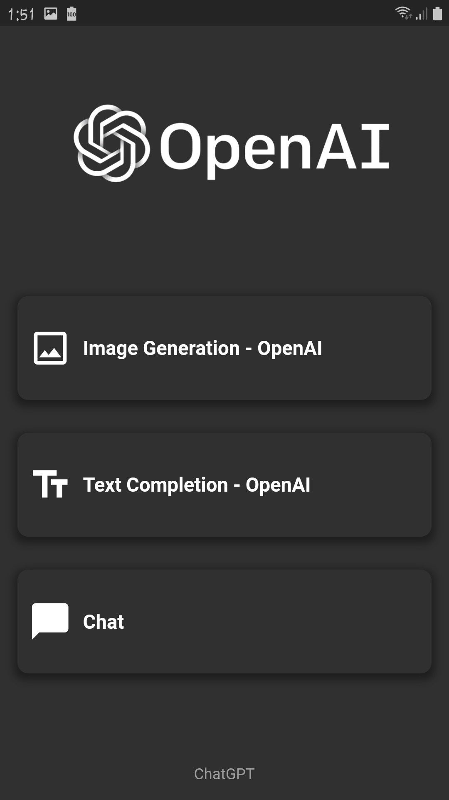
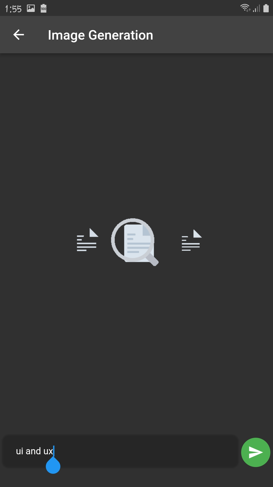
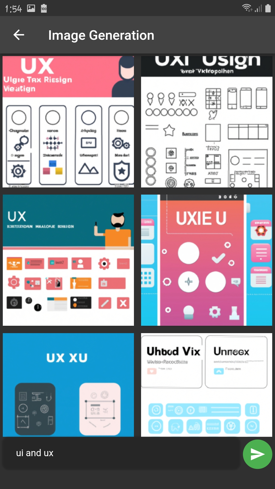

# Chat GPT : ( Clean architecture with MVVM ).

 This project is powered by FLutter **3.0.5** and dart **2.17.6**.
 
# Screenshots:

<h3> 1- splash screen </h3>

<p align="center">
  
</p>

<h3> 2- Home screen </h3>

<p align="center">
  
</p>
<h3> 3- Image Generation screen </h3>
 
<p align="center">
  
  
  
</p>

<h3> 4- Text Completion screen </h3>

<p align="center">
  
</p>
<h3> 5- Screen Recorder </h3>
<p align="center">
  <video width="320" height="500" autoplay>
  <source src="https://drive.google.com/file/d/1BWbXQh2eReGT0swQ8Ch-NhZ7kEAAInMt/view?usp=sharing" type="video/mp4">
Your browser does not support the video tag.
</video>

https://drive.google.com/file/d/1BWbXQh2eReGT0swQ8Ch-NhZ7kEAAInMt/view?usp=sharing


</p>

The main packages used in the project:

```yaml
dependencies:

  cupertino_icons: ^1.0.2
  retrofit: ^3.0.1+1
  analyzer: ^5.2.0
  dio: ^4.0.6
  dartz: ^0.10.1
  internet_connection_checker: ^1.0.0+1
  pretty_dio_logger: ^1.2.0-beta-1
  freezed_annotation: ^2.2.0
  json_annotation: ^4.7.0
  flutter_bloc: ^8.1.1
  equatable: ^2.0.5
  get_it: ^7.2.0
  flutter_staggered_grid_view: ^0.6.2
  cached_network_image: ^3.2.3
  share_plus: ^6.3.0
  shimmer: ^2.0.0
  flutter_chatgpt_api: ^1.1.0

dev_dependencies:
  flutter_lints: ^2.0.0

  retrofit_generator: ^4.0.1
  build_runner: ^2.1.11
  json_serializable: ^6.2.0
```

## How to Use 

**Step 1:**

Download or clone this repo by using the link below:

```
https://github.com/osamasabry9/Flutter_ChatGPT.git
```

**Step 2:**

Go to project root and execute the following command in console to get the required dependencies: 

```
flutter pub get 
```

**Step 3:**

This project uses `inject` library that works with code generation, execute the following command to generate files:

```
flutter packages pub run build_runner build --delete-conflicting-outputs
```

or watch command in order to keep the source code synced automatically:

```
flutter packages pub run build_runner watch
```
### Folder Structure
Here is the core folder structure which flutter provides.

```
flutter-app/
|- android
|- build
|- ios
|- lib
    |- app/
    |- core/
    |- features/
    |- main
```

Here is the folder structure we have been using in this project

```
lib/app/
       |- app/
       |- base_usecase/
       |- constant/
       |- di/
       |- extension/

lib/core/
       |- error/
       |- network/
       |- widgets/
       |- utils/
            |- assets
            |- routes
            |- strings
            |- values
            
lib/features/
       |- splash/
       |- home/
       |- image_generation/
       |- text_completion/
       |- chat/  
       
 lib/features/image_generation/
       |- data/
       |- domain/
       |- presentation/       
       
data/
       |- data_source/
       |- model/
            |- mapper/
            |- responses/
       |- repository/

domain/
       |- entities/
       |- repository/
       |- usecase/

presentation/
       |- cubit/
       |- pages/
       |- widgets/

```


